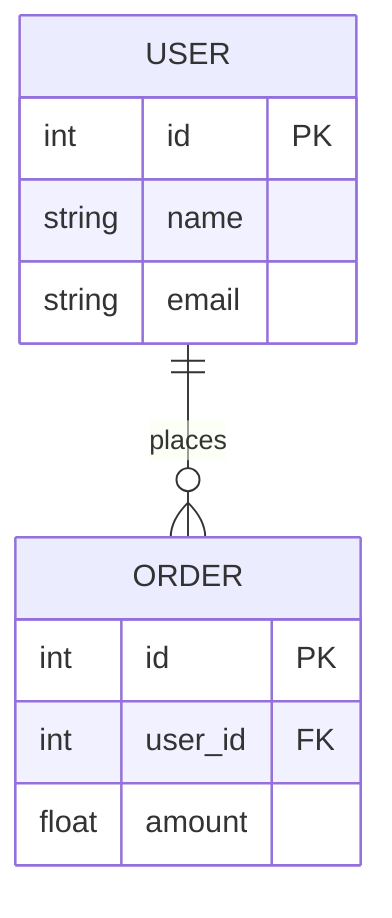
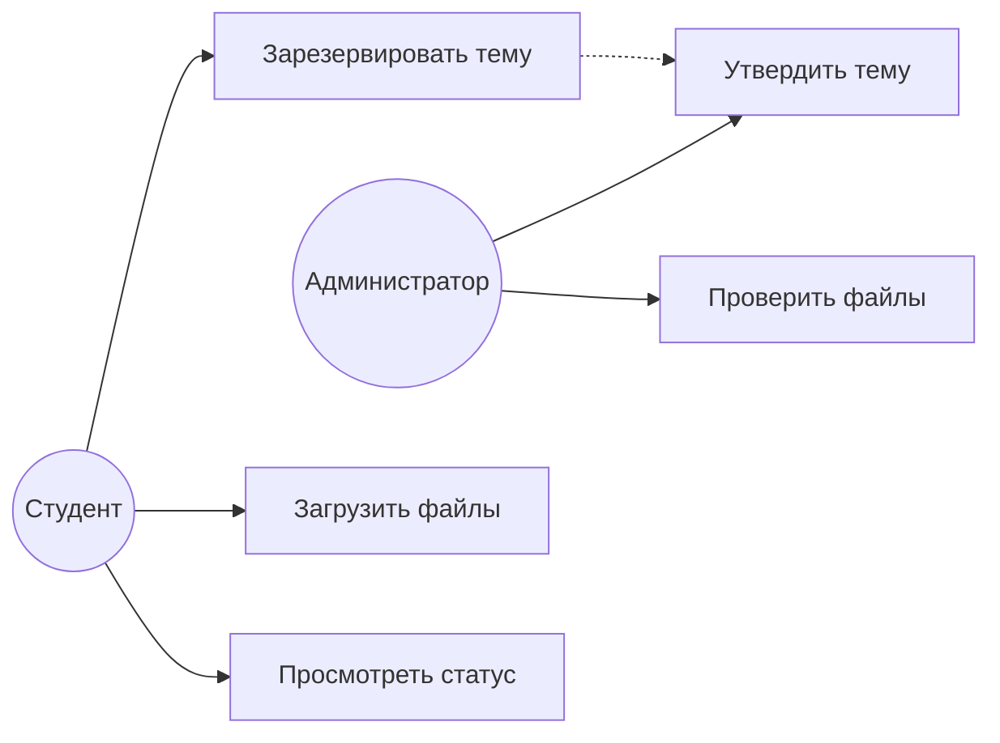
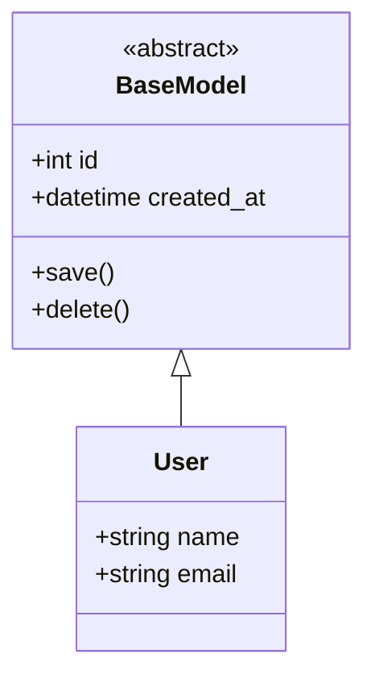
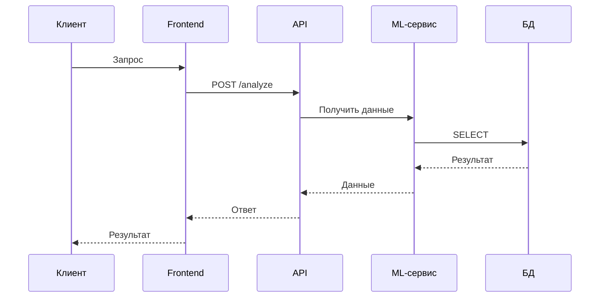
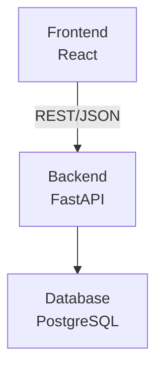
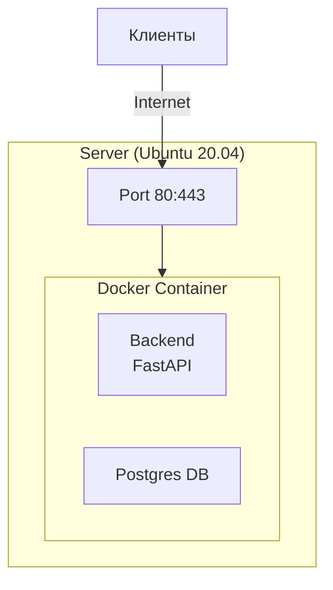
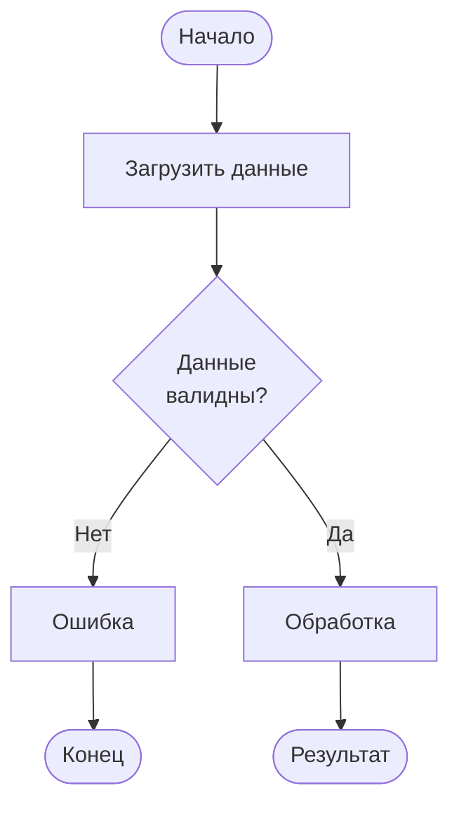
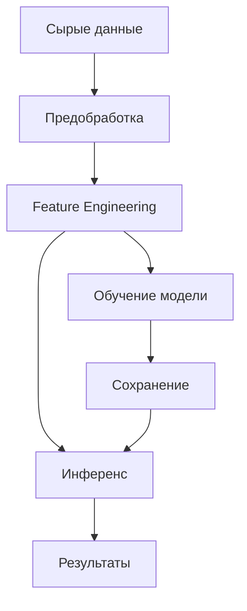
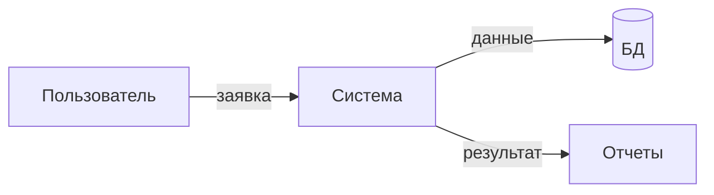
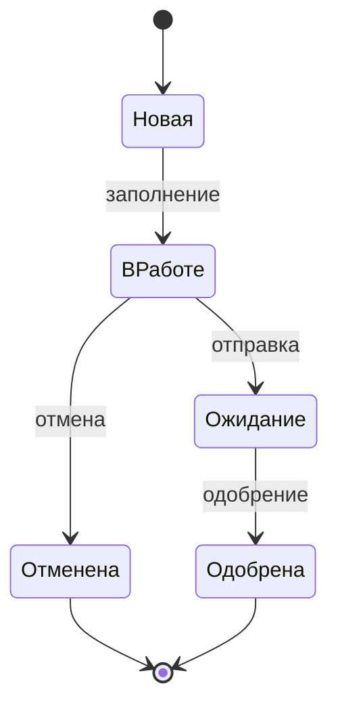

# Диаграммы и нотации для диплома

> **Цель:** Выбрать правильные диаграммы для представления разных аспектов системы в дипломной работе.

## Принцип выбора диаграммы

**Один аспект = одна диаграмма.**

- **Структура данных** → ERD
- **Процессы и workflow** → BPMN или Activity Diagram
- **Компоненты системы** → Component Diagram
- **Взаимодействие компонентов** → Sequence Diagram
- **Архитектура** → Deployment Diagram или Architecture Diagram

> **⚠️ Важно для диплома:** В этом гайде представлены примеры на **Mermaid** для быстрого прототипирования и документации в GitHub/README. Однако **для дипломной работы требуется использовать канонические нотации (UML, BPMN, DFD)**. Mermaid корректно поддерживает только ERD, Class, Sequence и State диаграммы. Для остальных типов используйте **draw.io**, **PlantUML** или **Lucidchart**, чтобы соответствовать стандартам.

---

## 1. Диаграммы баз данных

### ERD (Entity-Relationship Diagram) — структура БД

**Когда использовать:** Описание структуры данных в реляционной БД.

**Что показывать:**
- Таблицы (entities)
- Связи между таблицами (relationships)
- Ключевые поля (primary key, foreign key)
- Кардинальность (1:1, 1:N, M:N)

**Инструменты:**
- [dbdiagram.io](https://dbdiagram.io/) — быстро и удобно
- draw.io, MySQL Workbench
- Mermaid (в Markdown/GitHub)

**Пример (Mermaid):**

---

## 2. UML диаграммы

### 2.1 Use Case Diagram — сценарии использования

**Когда:** Описание функциональности системы с точки зрения пользователя.

**Что показывать:**
- Акторы (пользователи, внешние системы)
- Варианты использования (use cases)
- Связи актор-use case

**Mermaid пример (⚠️ Не соответствует официальной UML нотации! Для диплома используйте draw.io или PlantUML):**

**Где в дипломе:** Раздел "Требования к системе" или "Функциональность".

---

### 2.2 Class Diagram — классы и их связи

**Когда:** Описание структуры кода (ООП).

**Что показывать:**
- Классы
- Атрибуты и методы
- Связи: наследование, композиция, агрегация

**Пример (Mermaid):**

**Где в дипломе:** Раздел "Проектирование" для систем с ООП.

---

### 2.3 Sequence Diagram — взаимодействие компонентов

**Когда:** Описание порядка взаимодействия компонентов во времени.

**Что показывать:**
- Акторы/объекты
- Сообщения между ними (вызовы методов, API)
- Порядок выполнения

**Пример (Mermaid):**

**Где в дипломе:** Раздел "Реализация" — описание ключевых сценариев.

**Инструменты:**
- Mermaid, PlantUML, draw.io

---

### 2.4 Component Diagram — компоненты системы

**Когда:** Описание архитектуры на уровне компонентов.

**Что показывать:**
- Основные компоненты/модули
- Интерфейсы между ними
- Зависимости

**Mermaid пример (⚠️ Упрощенная версия! Для диплома используйте официальную UML Component нотацию через draw.io или PlantUML):**

**Где в дипломе:** Раздел "Архитектура системы".

---

### 2.5 Deployment Diagram — развертывание

**Когда:** Описание физической архитектуры (серверы, сети).

**Что показывать:**
- Узлы (servers, containers)
- Компоненты на узлах
- Сетевые соединения

**Mermaid пример (⚠️ Упрощенная версия! Для диплома используйте официальную UML Deployment нотацию через draw.io или PlantUML):**

**Где в дипломе:** Раздел "Развертывание" или "Инфраструктура".

---

### 2.6 Activity Diagram — алгоритм/процесс

**Когда:** Описание алгоритма или бизнес-процесса.

**Что показывать:**
- Действия (activities)
- Условия (decision points)
- Параллельные потоки

**Mermaid пример (⚠️ Flowchart ≠ UML Activity Diagram! Для диплома используйте официальную UML Activity нотацию через draw.io или PlantUML):**

**Где в дипломе:** Раздел "Алгоритмы" или "Бизнес-логика".

---

## 3. BPMN — бизнес-процессы

### Business Process Model and Notation

**Когда:** Описание сложных бизнес-процессов с множеством участников.

**Что показывать:**
- Дорожки (lanes) для участников
- События (старт, конец)
- Задачи (tasks)
- Шлюзы (gateways) — условия, параллелизм

**Где в дипломе:** Раздел "Анализ предметной области" для систем автоматизации процессов.

**Инструменты:**
- [bpmn.io](https://bpmn.io/)
- Camunda Modeler

---

## 4. Специализированные диаграммы

### 4.1 Диаграмма архитектуры ML-пайплайна

**Когда:** Для ML/Data Science проектов.

**Что показывать:**
- Источники данных
- Этапы обработки
- Обучение модели
- Инференс
- Мониторинг

**Mermaid пример (ℹ️ Для ML-пайплайнов нет строгой нотации, это приемлемо):**

---

### 4.2 Data Flow Diagram (DFD) — потоки данных

**Когда:** Описание движения данных в системе.

**Что показывать:**
- Внешние сущности (источники/потребители)
- Процессы обработки
- Хранилища данных
- Потоки данных

**Mermaid пример (⚠️ Не соответствует официальной DFD нотации! Для диплома используйте классическую DFD через draw.io):**

**Где в дипломе:** Раздел "Анализ данных" или "Потоки информации".

---

### 4.3 State Diagram — состояния объекта

**Когда:** Описание изменения состояний объекта.

**Что показывать:**
- Состояния
- Переходы между состояниями
- События, вызывающие переходы

**Пример (Mermaid):**

**Где в дипломе:** Раздел "Модель данных" для объектов с lifecycle.

---

## 5. Рекомендации по использованию

### 5.1 Обязательный минимум для диплома

**Backend/Full-stack система:**
- ✅ ERD — структура БД
- ✅ Component Diagram — архитектура
- ✅ Sequence Diagram — 1-2 ключевых сценария

**ML/Data Science проект:**
- ✅ Data Flow — откуда данные, куда идут
- ✅ ML Pipeline — этапы обработки и обучения
- ✅ Component Diagram — архитектура (если есть API)
- ✅ Activity Diagram — алгоритм обработки

**Автоматизация процессов:**
- ✅ BPMN — процесс as-is и to-be
- ✅ Use Case Diagram — роли и функции
- ✅ ERD — данные системы

### 5.2 Правила оформления

**✅ Хорошо:**
- Подпись: "Рисунок X. [Название диаграммы]"
- Все элементы подписаны на русском
- Легенда, если нужна
- Ссылка на диаграмму в тексте
- Векторный формат (SVG, PDF) или высокое разрешение

**❌ Плохо:**
- Диаграмма без подписи
- Непонятные сокращения
- Мелкий нечитаемый текст
- Скриншот из IDE без обработки
- Диаграмма "для галочки" без объяснений

### 5.4 Инструменты

**Универсальные:**
- **draw.io** ([app.diagrams.net](https://app.diagrams.net/)) — бесплатно, все типы диаграмм
- **PlantUML** — текстовое описание → диаграмма
- **Mermaid** — диаграммы в Markdown

**Специализированные:**
- **dbdiagram.io** — ERD
- **bpmn.io** — BPMN
- **Lucidchart** — все типы (платная)

**Из кода:**
- Python: `diagrams` library — архитектура cloud систем
- Mermaid в Jupyter Notebook

---

## 6. Примеры для частых задач

### Задача: "Система мониторинга качества воздуха"

**Набор диаграмм:**

1. **Component Diagram** — архитектура
   - IoT датчики
   - Backend (сбор данных)
   - БД (time-series)
   - ML-сервис (прогноз)
   - Frontend (визуализация)

2. **Sequence Diagram** — сценарий "Получение данных с датчика"
   - Датчик → Backend → Валидация → БД → Алерт (если превышен порог)

3. **ERD** — структура данных
   - Таблицы: sensors, measurements, alerts, forecasts

4. **Activity Diagram** — алгоритм прогнозирования
   - Получить данные → Предобработка → Модель → Прогноз → Сохранить

### Задача: "Детекция мошенничества в соцвыплатах"

**Набор диаграмм:**

1. **Use Case** — роли и функции
   - Оператор: загрузить заявку, просмотреть риск-скор
   - Система: анализ, выдача рекомендации

2. **ERD** — данные
   - Таблицы: applications, users, risk_scores, models

3. **ML Pipeline** — процесс обучения
   - Данные → Feature engineering → Обучение → Валидация → Деплой

4. **Sequence Diagram** — сценарий "Проверка заявки"
   - Оператор → API → ML-модель → Граф связей → Риск-скор

---

## 7. Чек-лист диаграмм для диплома

Перед сдачей:

- [ ] Все диаграммы пронумерованы и подписаны
- [ ] Диаграммы соответствуют реализации (не выдумка!)
- [ ] Текст на диаграммах читаем (размер шрифта ≥ 10pt)
- [ ] Используется единый стиль
- [ ] В тексте есть ссылки на каждую диаграмму
- [ ] Диаграммы объясняют, а не дублируют текст
- [ ] Нет излишних деталей (только суть)

---

## Связь с другими гайдами

- **Проектирование систем:** [140-system-dev.md](140-system-dev.md)
- **Выбор архитектуры:** [150-architecture-choice.md](150-architecture-choice.md)
- **Методология:** [110-methodology.md](110-methodology.md)

---

**Помните:** Диаграмма должна упрощать понимание, а не усложнять. Если диаграмма не добавляет ценности — не рисуйте её.
